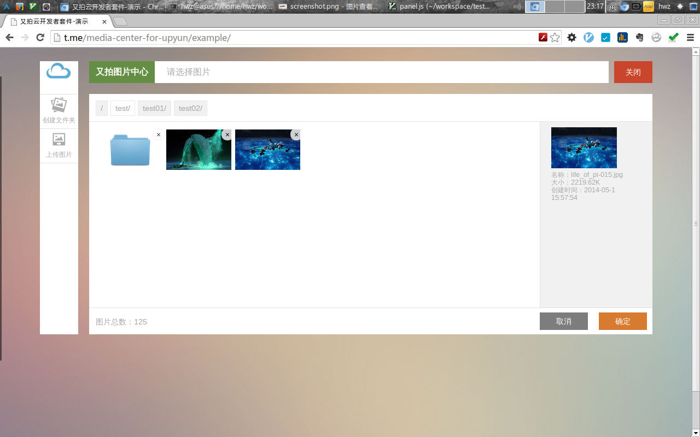

# 又拍开发者套件

## 简介
又拍开发者套件希望能够使用开发者和用户更方便的使用又拍云服务。套件前端基于jQuery,
后端封装了`upyun.class.php`,前后端约定以某一简单协议进行交互,目前支持`jQuery调用`, `百度UEditor`和`KindEditor`




## 快速使用

### 前端
HTML
```html
    <script src="dist/upyun.min.js" type="text/javascript" charset="utf-8"></script>
    <link rel="stylesheet" href="dist/themes/default/style.css" type="text/css" media="screen" charset="utf-8">
    <input type="text" class="upyun" />
    <textarea id="u-content"></textarea>
    <textarea id="keditor"></textarea>
```

jQuery
```javascript
    $('.upyun').upyun({
        api:'/php/api.php'
    });
```
百度UEditor
```javascript
    var editor = UE.getEditor('u-content');
    editor.addListener( 'ready', function() {
        upyun.setUpUEditor(this,{
            api:'/php/api.php',
            style:'!small'
        });
    } );

```
KindEditor
```javascript
    KindEditor.ready(function(K) {
        var keditor = K.create('#keditor',{
            width:'100%'
        });
        upyun.setUpKEditor(keditor,{
            api:'/php/api.php',
            style:'!small'
        });
    });
```


### 服务端
php
```php
<?php

    include('upyun.class.php');
    include('UpCloud.php');

    $upCloud = new UpCloud(BUCKET,NAME,PWD,HOST);
    $upCloud->takeOver();

    //End of file 
```


## API

### 前端
html 扩展
```html
<input type="text" date-api="api.php" data-title="请选择一张图片作为封面" data-holder="" data-filter="{type:['png','jpg']}" />
```
1. `data-api` 服务端处理地址
2. `data-title` 面板标题
3. `data-holder` 选择图片后图片放入指定容器值为ID
4. `data-filter` 过滤器 {type:['png']}(实现中)

javascript 扩展

```javascript

        var opts = {
            title:'请选择图片',        // 面板标题
            panelLogo:'~/logo.png',    // 面板左上角logo
            editorIcon:'~/cloud.png',  // 富文本编辑器中的按钮图片
            folderIcon:'~/folder.png', // 文件夹图片
            tWidth:120,                // 面板中缩略图的宽度限制 用于等比例缩放
            tHeight:74,                // 面板中缩略图的高度限制 用于等比例缩放
            multiSelect:false,         // 多选
            multiUpload:false,         // 多文件上传
            onOK:function(){},         // 选择图片后回调
        };
```

### 服务端
基础调用 
```php
<?php
    include('upyun.class.php');
    include('UpCloud.php');

    $upCloud = new UpCloud(BUCKET,NAME,PWD,HOST,SIZE);
    $upCloud->takeOver();
```

添加hook,处理函数都可以得到UpCloud $this 实例
```php
<?php
    include('upyun.class.php');
    include('UpCloud.php');

    $upCloud = new UpCloud(BUCKET,NAME,PWD,HOST,SIZE);

    $upCloud->when('preGetList',function($_this){ });
    $upCloud->when('postGetList',function($_this,$list){ });
    $upCloud->when('preUpload',function($_this,$file){ });
    $upCloud->when('postUpload',function($_this,$response){ });
    //删除同时处理文件夹和文件删除 
    $upCloud->when('preDelete',function($_this,$data){});
    $upCloud->when('postDelete',function($_this,$data){});
    $upCloud->when('preMkdir',function($_this,$data){});
    $upCloud->when('postMkdir',function($_this,$data){});


    // 开始接管
    $upCloud->takeOver();
```

