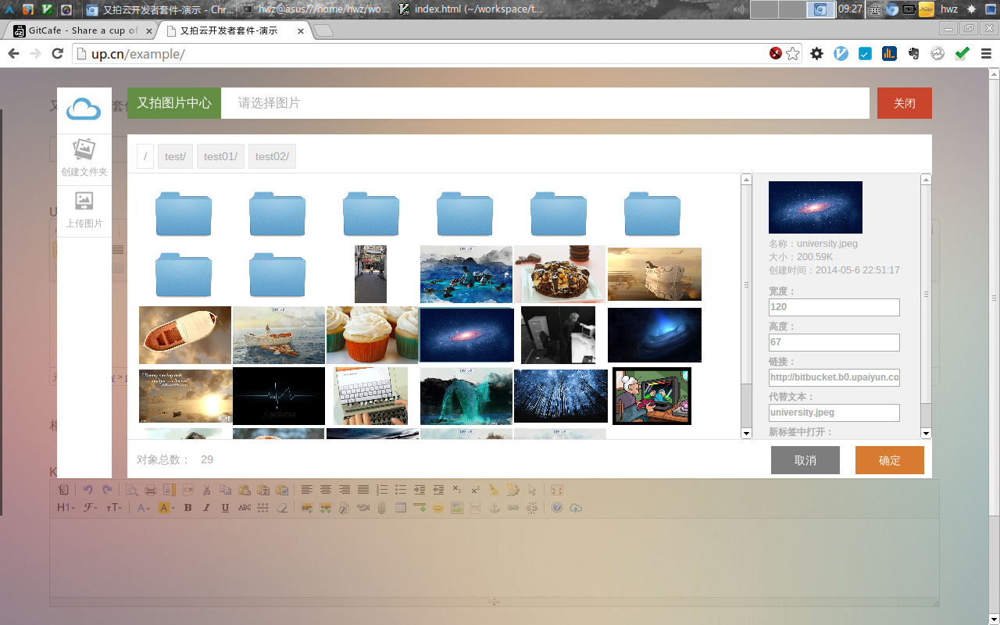

# 又拍开发者套件



## 开发列表

- 多文件上传
- 插入编辑器时可编辑


## 一分钟入门

### 前端
```html

	<script src="dist/upyun.min.js" type="text/javascript" charset="utf-8"></script>
	<link rel="stylesheet" href="dist/themes/default/style.css" type="text/css" media="screen" charset="utf-8">
	<input type="text" class="upyun" />
```

```javascript

	$('.upyun').upyun({
		api:'/php/api.php'
	});
```


### 服务端
```php
	
	<?php

    include('upyun.class.php');
	include('UpCloud.php');

	$upCloud = new UpCloud(BUCKET,NAME,PWD,HOST);
	$upCloud->takeOver();

	//End of file 
```


## 扩展

### 前端

### 服务端
